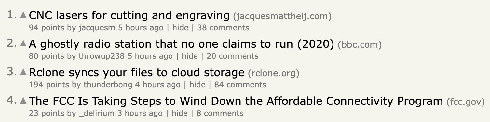
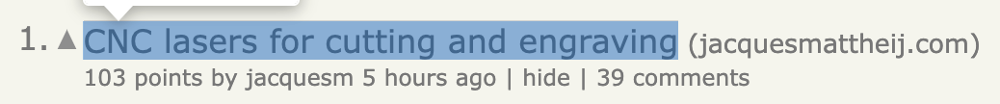
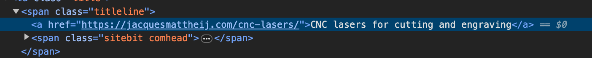
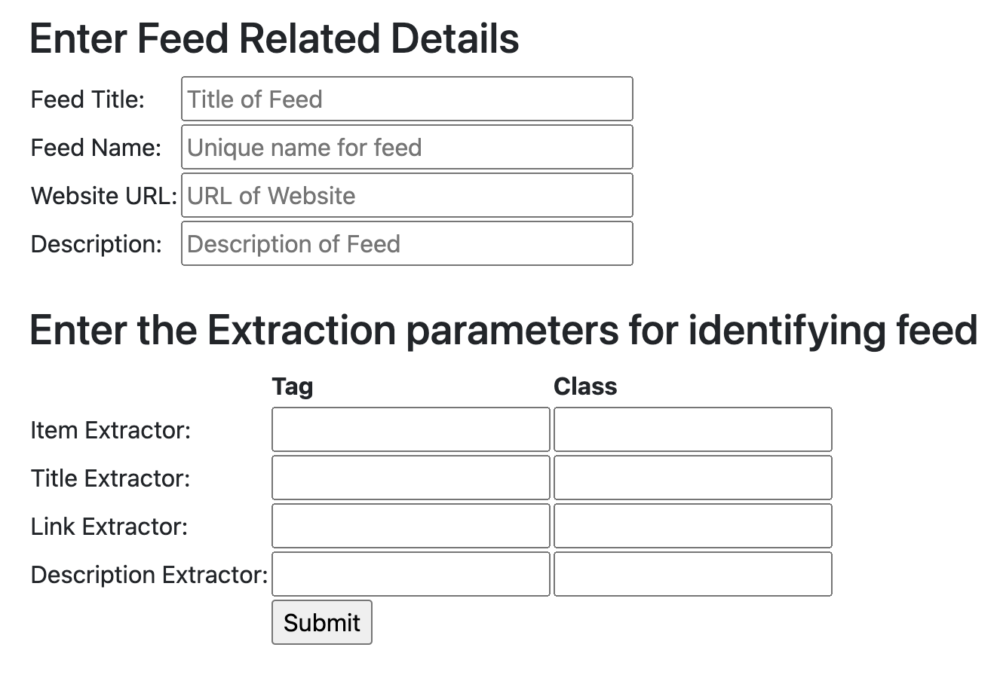
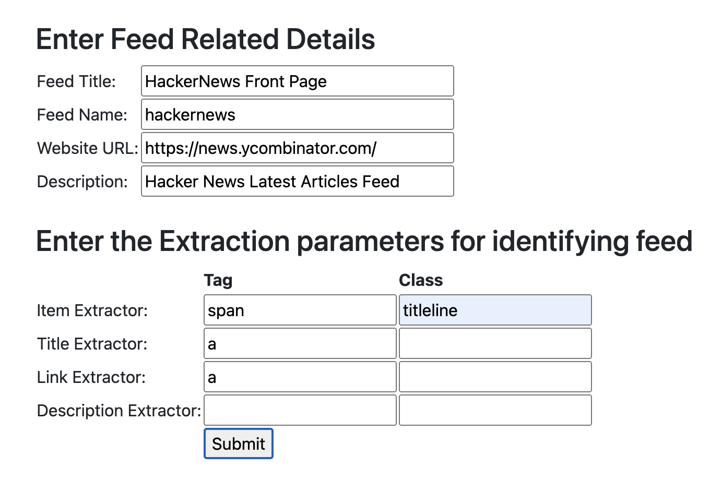
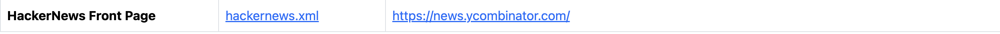

### Feeder

- This project aims to turn many websites to RSS Feed which we can then monitor using RSS readers.
- This [link](https://www.xul.fr/en-xml-rss.html) explains what are RSS feeds pretty well.

### Local Startup

- Ensure that you have `python3` installed then run the following commands:
    - `python3 -m venv .venv` : this creates a virtual environment
    - `source ./.venv/bin/activate` : activates the virtual environment where we will install our dependencies.
    - `python3 -m pip install -r requirements.txt` : installs the dependencies.
    - `python3 app.py` : starts the app on port `8000` which you can access on `127.0.0.1:8000`
- Once the app is started one can find few feeds that we have tested it upon for their reference.

### How to use the app?

- To create RSS Feed we mainly need two things: `title` and `link`. There's an optional third thing, `description`,
  which can be skipped.
- A website consists of html pages which have elements like `<li>`, `<a>`, `<article>`, `
` etc.
- `li`, `a`, `article` are called **tags**. The elements also **may** have `class` attribute associated with them.
- `class` attribute are used to apply `css` to a bunch of elements together. They also uniquely identifies
  elements in the webpage.
- To create RSS feed we need to identify such **common** elements on a webpage. For instance, like items which appears
  in listing formats.
- Once we have identified the element we need to find two sub element in that item pertaining to `title` and `link` for
  our feeds.
- Those two sub elements can also have class to identify them uniquely.
- With these three things we can create the main component of our RSS feed `<item>`.
- Consider the below HackerNews front page
  
- This has 4 items in list format. In a day these items get updated, and we can use RSS feeds to track them.
- A single item is something like :
  
- To identify the `element` associated with the list item we can right-click on the list title and select `inspect`
- The result is shown below:
  
- The item here would be `span` with `class` attribute `titleline`
- The title and link element both will be `a` without any class attributes.
- Once we have identifies these items we need to fill the following form:
  
- *Feed title* is the title of the feed
- *Feed name* is something to uniquely identify the feed one is tracking.
- *Website URL* is the URL for which to create the feed.
- *Description* is self-explanatory.
- Now we need to fill the extractor elements. From the above example:
    - For item extractor values we have to use `span` as tag and `titleline` as class
    - For title extractor values we have to use just `a` tag and keep class column blank.
    - For link extractor values also we have to use just `a` tag and keep class column blank.
- After filling the form it should look like this:
  
- Once we submit it we will get a page which will have the feed url with other details and will look like this:
  
- Copy the `hackernews.xml` link and add it to RSS Feed readers.

### Design & Implementation

- We are using `requests` library to get the webpage.
- Then `BeautifulSoup` to extract the relevant elements and create the `<item>` for RSS feed.
- We are saving the feeds in `static/feeds` directory and there is a `feeds.db` table where we save feed metadata.
- There is an `updater.py` file which runs at a fixed interval and using the metadata rescans **urls** to update the
  feed items.
    - It also deletes any item older than **3** days.
- For some websites the web page is not loaded completely after executing the JavaScript.
- For such pages we used `selenium.webdriver` to execute it and wait a second for it to load completely.
    - There is a fair chance that the page could still not be loaded completely in which case we won't be able to track
      it.

### Hosting

- We have tried self-hosting it in DigitalOcean. If you want to do the same there are scripts in `scripts` folder.
- You first need to configure `doctl`. Here is a [link](https://docs.digitalocean.com/reference/doctl/how-to/install/)
  on how to do it.

### Comments

- Currently, we rescan all the feeds at a fixed interval. We can optimize it to scan each site at a fixed interval.
- We are also not passing request headers like `If-Modified-Since` or checking response headers like `Last-Modified`.
- We can add a LLM button to find the extractors given a web page.
- For websites which only load completely after running JS we can create a separate slightly long-running process to load them.
- This might not work well with small screens as it has been tested only on Laptop.